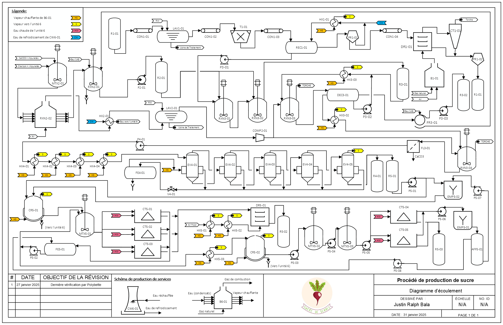
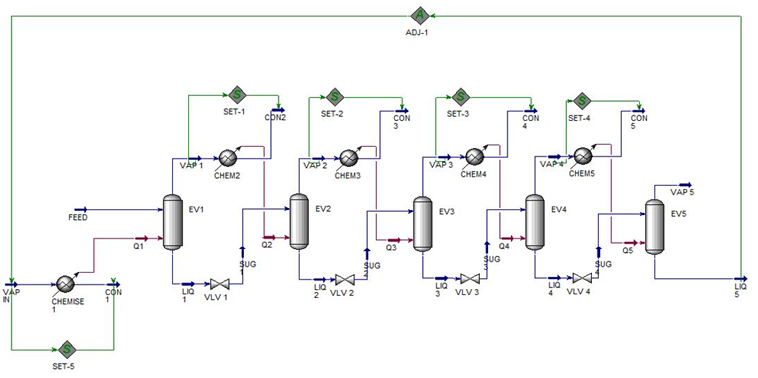

# Justin Ralph Bala
**Chemical Engineering — Polytechnique Montréal**

Chemical engineering student in the biofabrication / biomanufacturing stream. This page presents selected academic projects that reflect my approach to engineering analysis, modeling, and process understanding, with an emphasis on using simulation tools to study real process behavior.

---

## Projects

---

### Plant-Wide Modeling and Analysis of a Sugar Extraction Process

End-to-end modeling and analysis of an industrial sugar extraction plant, with emphasis on mass and energy balances, steady-state operation, and dynamic behavior of evaporator systems.

**Tools:** Excel (VBA), Aspen HYSYS, Python, MS Visio  
**Focus:** Process modeling · Energy analysis · Dynamic systems

<strong>View project details</strong>

<h4>Phase I — Process Understanding &amp; Process Flow Diagram (PFD)</h4>

Development of a structured understanding of the sugar extraction process based on technical literature and the plant description provided. 
An industrial-style process flow diagram (PFD) was developed <strong>individually</strong> using MS Visio to represent major unit operations and material flows.

<strong>Sugar Plant Flowsheet (PFD)</strong>

  

<h4>Phase II — Plant-Wide Mass Balance &amp; Operator-Oriented Simulator</h4>

Design and implementation of a <strong>plant-wide, feed-defined mass balance</strong> in the form of an <strong>operator-oriented Excel simulator</strong> (VBA/macros). The tool allows users to vary operating conditions and observe their impact on the process while maintaining numerical consistency.

<em>
I contributed primarily to the mass balance formulation and simulator logic, and later extended the tool with additional input handling and safeguards.
</em>

<strong>Simulator Features</strong>

<ul>
  <li>Automatic propagation of flowrates across interconnected process units</li>
  <li>User-adjustable operating parameters with protected calculation cells</li>
  <li>Built-in checks to prevent non-physical operating conditions</li>
  <li>Designed for rapid “what-if” analysis rather than detailed optimization</li>
</ul>

<h4>Phase III — Steady-State Modeling of an Evaporator Cascade</h4>

Steady-state simulation of a <strong>five-effect evaporator cascade</strong> operating in series using Aspen HYSYS. 
The model incorporated energy integration and was used to perform sensitivity analyses on key operating parameters. This phase was completed <strong>individually</strong>.

  

<h4>Phase IV — Dynamic Modeling of an Evaporator System</h4>

Dynamic modeling of a <strong>single evaporator unit</strong> to analyze transient behavior under operating disturbances. 
The system was represented by a coupled set of ordinary differential equations describing liquid concentration, pressure, temperature, and liquid level.

<strong>My contribution</strong>

<ul>
  <li>Development of a nonlinear dynamic evaporator model in Python</li>
  <li>Implementation of steady-state and transient simulations</li>
  <li>Linearization around steady state and derivation of transfer-function representations</li>
  <li>Interpretation of process behavior under controlled disturbances</li>
</ul>

<strong>Representative results</strong>

<ul>
  <li>Time-dependent profiles of temperature, concentration, liquid level, and pressure</li>
  <li>Transient responses to step changes in operating conditions</li>
  <li>Comparison between steady-state predictions and dynamic behavior</li>
  <li>Comparison of nonlinear, linearized, and transfer-function-based models</li>
</ul>

<table>
  <tr>
    <td align="center">
       
      <em>State variables at steady state</em>
    </td>
    <td align="center">
       
      <em>Effect of a 5% increase in heating jacket temperature</em>
    </td>
  </tr>
  <tr>
    <td align="center">
       
      <em>Effect of a 10% increase in liquid feed flowrate</em>
    </td>
    <td align="center">
       
      <em>Effect of a 5% decrease in vapor outlet flowrate</em>
    </td>
  </tr>
</table>

---

## Skills & Tools Demonstrated

- Python (NumPy, SciPy, Matplotlib)  
- Numerical solution of ordinary differential equations  
- Process modeling and simulation  
- Aspen HYSYS  
- Mass and energy balance implementation  
- Technical analysis and documentation  

---

## Contact

- LinkedIn: https://www.linkedin.com/in/justinralph-bala  
- GitHub: https://github.com/Justin-Bala
