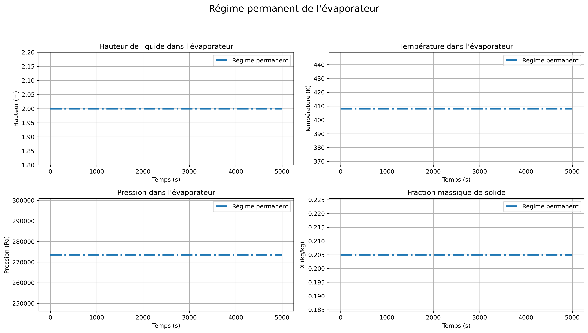
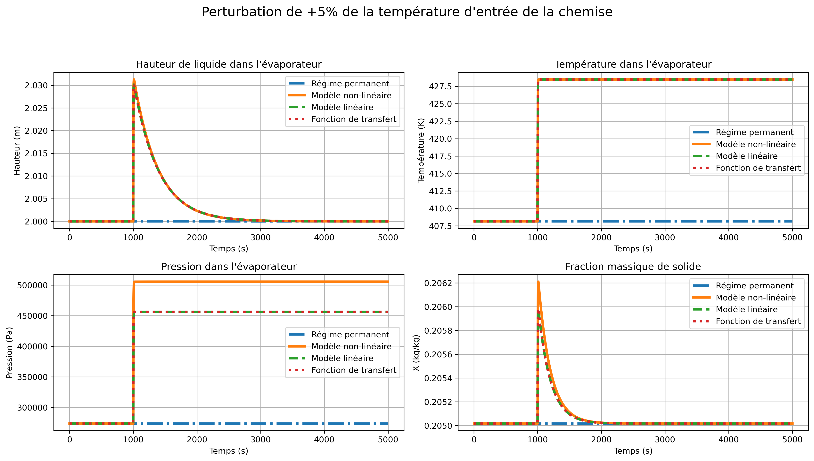
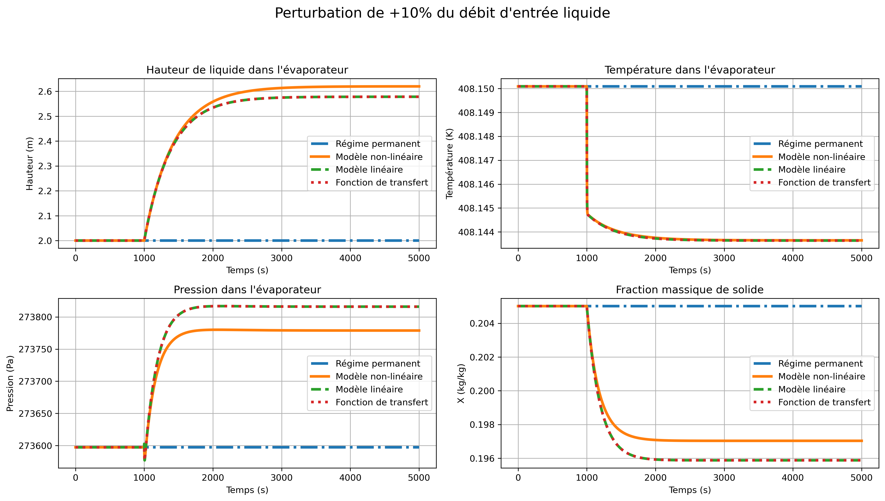
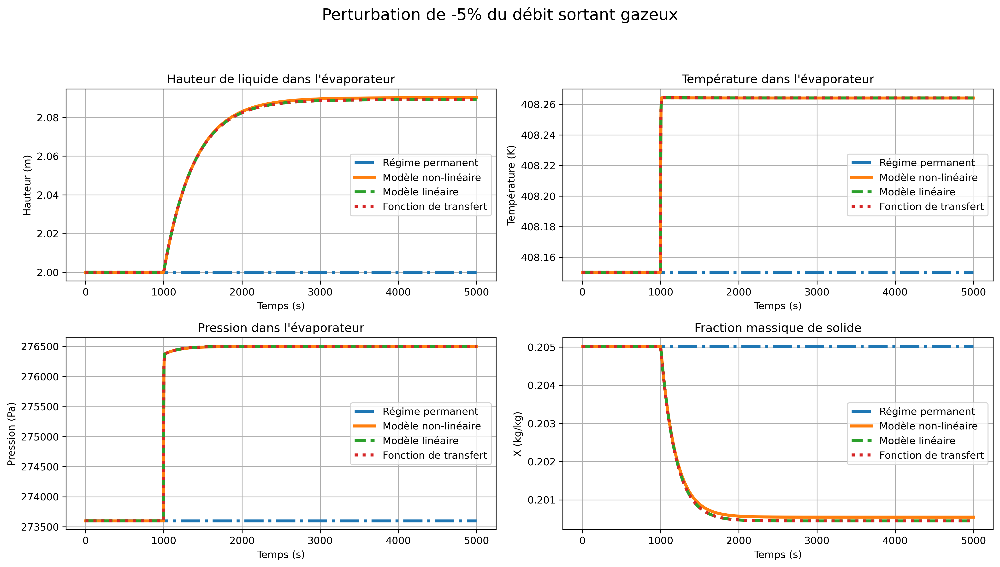

# Justin Ralph Bala
**Chemical Engineering at Polytechnique Montréal**

I am a chemical engineering student in the biofabrication/ biomanufacturing stream. This page presents selected projects that reflect my approach to engineering analysis and problem-solving.
My academic projects emphasize using modeling and simulation as tools to understand process behavior

---

## Projects

### Dynamic Evaporator Model
**Context:** Academic team project (Chemical Engineering)  
**Focus:** Mass & energy balances, steady-state and transient modeling
This project focuses on the dynamic modeling of an industrial evaporator,
with emphasis on transient behavior and system coupling.

**What I did**
- Developed and analyzed a dynamic evaporator model in Python
- Implemented steady-state and transient simulations
- Interpreted process behavior under changing operating conditions

**Key results**
- Time-dependent temperature and concentration profiles
- Comparison between steady-state and dynamic behavior

  

<strong>Results</strong>

<table>
  <tr>
    <td align="center">
       
      <em>Caption for figure 1</em>
    </td>
    <td align="center">
       
      <em>Caption for figure 2</em>
    </td>
  </tr>
  <tr>
    <td align="center">
       
      <em>Caption for figure 3</em>
    </td>
    <td align="center">
       
      <em>Caption for figure 4</em>
    </td>
  </tr>
</table>

**Links**
- 📄 Report (PDF)
- 📊 Results & figures
- 💻 Code

---

### Thermal Cable Model
**Context:** Academic team project (Numerical Modeling)  
**Focus:** Heat transfer, finite-difference methods

**What I did**
- Implemented a finite-difference thermal model in Python
- Simulated transient temperature evolution in a cable
- Studied the effect of material properties and boundary conditions

**Key results**
- Radial temperature profiles
- Sensitivity to thermal parameters

**Links**
- 📄 Report (PDF)
- 📊 Results & figures
- 💻 Code

---

## Skills & Tools
- Python (NumPy, SciPy, Matplotlib)
- Numerical methods (ODEs, finite differences)
- Process modeling & simulation
- Engineering analysis & documentation

---

## Contact
- LinkedIn: [your link]
- GitHub: [your GitHub profile]
